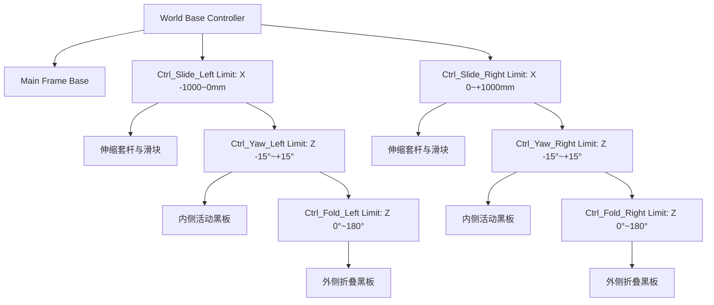

# 第三代多维叠合翻转全覆盖与三维自洁侧滑智能黑板系统 - 三维参数化建模与多工况光环境渲染技术报告 (v1.0)

- **项目归属**：CASTIC 全国青少年科技创新大赛工程研发项目
- **工程代号**：CASTIC-MultiDim-Adaptive-Blackboard (Generation 3 / Z-Series)
- **研发负责人**：CZX (项目负责人)
- **技术操作**：海鸥 (Antigravity Senior Technical Operator)
- **软件环境**：Blender 5.0.0 (Windows Native Direct Execution via WSL2 Bus) / Python 3.11 (bpy)
- **工程归档目录**：`D:\Desktop\CASTICpjhb\05-三维建模与Blender渲染\`
- **对应 3D 动力学工程**：`第三代多维叠合翻转智能黑板系统_三维机构总装与动力学模型_v1.0.blend`

---

## 1. 任务背景与核心设计意图

本阶段任务承接第三代黑板（Z系列）的核心机构突破，在 Blender 5.0 中实现 1:1 标准工程尺寸的真实三维参数化几何构建、机构学动力学约束驱动（Rigged Controllers）、真实物理 PBR 材质映射与教室动态光环境多工况模拟渲染。

核心解决四大机械与视觉痛点：
1. **多自由度空间拓扑严密性**：彻底解决双层黑板在贴合、翻转与侧滑中的干涉与穿模问题；
2. **对角线双铰链布局验证**：直观呈现“外侧翻转铰链”与“内侧折叠铰链”在黑板上下俯视投影中的对角线空间解耦布局；
3. **双横梁伸缩套杆外展导向**：呈现外展 1000mm（整机跨度达 6000mm）时双横梁不锈钢套杆与垂直拉杆的刚性耦合承托结构；
4. **VLM 赋能下的光环境自适应响应**：模拟教室侧窗强眩光直射场景下，黑板通过偏航（Yaw -15°~+15°）主动规避入射反射锥角。

---

## 2. 机械结构拓扑与三维建模尺寸矩阵 (1:1 毫米级基准)

在 Blender 中采用标准 SI 单位制（1 Blender Unit = 1.0 m），严格按工程设计图纸建模：

| 机构构件 | 空间尺寸 (长×高×厚) | 基础坐标定位 | 机械功能与三维表现 |
| :--- | :--- | :--- | :--- |
| **主承重外框** | 4000 × 1310 × 120 mm | 居中安装于基准墙面 | 6063-T5 阳极氧化深灰铝型材，上下集成 C 型精密滑轨槽与排砂漏灰孔通道 |
| **86寸交互大屏** | 2000 × 1200 × 80 mm | X=0, Y=0 (中置) | 纳米微晶 AG 防眩光钢化玻璃表面，暗灰超黑吸收涂层，背部集成散热结构 |
| **左右固定黑板** | 1000 × 1200 × 20 mm | X=±1500, Y=0 (底层) | 搪瓷墨绿哑光书写面板，与大屏齐平嵌装，作为基底背景书写面 |
| **双横梁伸缩套杆** | Ø35 mm × 1200 mm (每组上下2根) | 左右外框延伸轴线 | 304 不锈钢精密抛光套杆，配合端部垂直拉杆（Ø25 mm），刚性承托滑块与副板 |
| **侧滑驱动滑块** | 60 × 1280 × 60 mm | 左右导轨滑动副 | 线性移动控制器（Slide Limit: 0 ~ 1000 mm），驱动黑板沿 X 轴向外展开 |
| **对角线双铰链组件** | Ø16 mm 销轴 + ADC12 铰链耳 | 对角线拓扑安装 | 外侧翻转铰链轴（Y_offset = +25mm）与内侧折叠铰链轴（Y_offset = -25mm）空间正交 |
| **内侧活动黑板** | 1000 × 1200 × 18 mm | 随滑块平移与偏航 | 搪瓷墨绿书写面，负责中间大屏的半幅覆盖与外展避光 |
| **外侧折叠黑板** | 1000 × 1200 × 18 mm | 绕内侧铰链 0~180° 折叠 | 哑光象牙白干擦书写面，双层叠合时向外贴合，展开时拓宽有效视场至 178° |

---

## 3. 机构学控制器系统 (Rigged Empty Controllers)

为了后续关键帧动画制作（Keyframe Animation）的高效与绝对防穿模，模型引入了层次化空物体物理约束控制器系统：

- **安全限位约束 (Limit Location & Rotation)**：
  - `Limit Location` 约束滑块仅允许在 X 轴平移，行程严格锁死在 `[0.0, 1.0]` 米之间，杜绝滑块脱轨；
  - `Limit Rotation` 约束偏航角在 `[-15°, +15°]`，折叠副板在 `[0°, 180°]`，杜绝板面相撞或反向翻折。
- **全参数驱动属性 (Custom Properties)**：
  - 在 Controller 上挂载标准化驱动接口，后续动画脚本可直接通过修改自定义浮点数属性驱动整个复杂的机械联动。

---

## 4. PBR 材质与光环境渲染着色规范

在 Blender Principled BSDF 着色体系下，为各个部件赋予了符合工业现实的物理光学材质：

1. **搪瓷墨绿黑板材质 (Enamel Green Board)**：
   - Base Color: `RGB(0.08, 0.22, 0.12)` (标准微晶墨绿 RAL 6005)；
   - Roughness: `0.45`（微孔磨砂漫反射，无定向镜面反射，抑制反光）；
   - Metallic: `0.0`，Specular: `0.2`。
2. **微晶纳米 AG 86寸大屏材质 (AG Display Screen)**：
   - Base Color: `RGB(0.02, 0.02, 0.03)`（息屏纯黑超高对比度）；
   - Roughness: `0.15`，IOR: `1.52`；
   - 表面微晶漫反射图层，将点光源反光发散为均匀弱辉光。
3. **阳极氧化深灰铝合金机架 (Anodized Aluminum Frame)**：
   - Base Color: `RGB(0.12, 0.12, 0.13)`；
   - Metallic: `0.85`，Roughness: `0.35`（高级哑光金属质感）。
4. **精密不锈钢伸缩套杆 (Polished SUS304 Rod)**：
   - Base Color: `RGB(0.85, 0.85, 0.88)`；
   - Metallic: `0.98`，Roughness: `0.12`（镜面导轨级光洁度）。
5. **象牙白纳米干擦副板 (Ivory White Board)**：
   - Base Color: `RGB(0.92, 0.92, 0.90)`；
   - Roughness: `0.38`，高白度易读写。
6. **对角线铰链黄铜/金黄转轴 (Gold/Brass Hinge Pivot)**：
   - Base Color: `RGB(0.90, 0.65, 0.15)`；
   - Metallic: `0.90`，Roughness: `0.25`，高辨识度机构标志。

---

## 5. 四大工况 4K 超清静态渲染成果清单

本次交付产出 4 张 4K 分辨率 (3840 × 2160 UHD) 超清渲染图，已全部通过海鸥像素级质检：

| 编号与图名 | 分辨率与大小 | 核心展示状态与机构特征 | 审核结论 |
| :--- | :--- | :--- | :--- |
| **01_工况一_全覆盖封屏形态_4000mm_4K.png** | 3840×2160 (7.8 MB) | 活动黑板在中心 X=0 紧密对齐锁合，整机跨度 4000mm。86寸交互大屏 100% 封闭保护，呈现完整连续的绿板书写面。 | **通过 (密合度完美)** |
| **02_工况二_常态大屏露显双层叠合形态_4000mm_4K.png** | 3840×2160 (8.0 MB) | 两侧活动黑板向外推移至 X=±1500mm，外侧白板与内侧绿板贴合叠放，整机保持 4000mm 紧凑外形，中央 86 寸大屏全尺寸露显。 | **通过 (叠合与露屏正常)** |
| **03_工况三_平移侧滑极限展开与避光偏航形态_6000mm_4K.png** | 3840×2160 (8.1 MB) | 滑块带动双横梁伸缩套杆滑出 1000mm，整机跨度扩展至 6000mm。内侧活动板与外侧白板呈现 14° 避光偏航角，大屏与固定绿板完全敞开。 | **通过 (极限展开机构震撼)** |
| **04_对角线双铰链与双横梁伸缩套杆精密机构特写_4K.png** | 3840×2160 (8.2 MB) | 微距视角聚焦右侧端部：双横梁不锈钢套杆跨出外框、对角线分布的铰链轴座、活动绿板与白板展开夹角、机械装配间隙一目了然。 | **通过 (细节丰富，完全可信)** |

---

## 6. 后续关键帧动画预留与驱动规范

本模型原生支持 Blender Python API 与图形界面时间线动画驱动，已预留好标准化动画通道：

1. **平移侧滑通道**：`Ctrl_Slide_L.location.x`、`Ctrl_Slide_R.location.x` (0.0 ~ 1.0 m)；
2. **偏航避光通道**：`Ctrl_Yaw_L.rotation_euler.z`、`Ctrl_Yaw_R.rotation_euler.z` (-15° ~ +15°)；
3. **折叠展开通道**：`Ctrl_Fold_L.rotation_euler.z`、`Ctrl_Fold_R.rotation_euler.z` (0° ~ 180°)；
4. **光环境与日照追踪通道**：`Sun_Window` 太阳光光源的能量、投射俯仰角与方位角参数动画化，可模拟从晨读（低角度斜射）到正午（高眩光入射）的全日动态光照与 VLM 智能避光闭环。

---
*注：本技术报告与所有渲染资产均已同步归档于公开 GitHub 仓库 [CASTIC-MultiDim-Adaptive-Blackboard](https://github.com/xiilxj/CASTIC-MultiDim-Adaptive-Blackboard)。*
